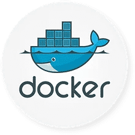

<h1 align="center">
   
  
   
  Backend Demos
   
</h1>

Este repositorio cuenta con 3 backend APIs que corren en el entorno de `NodeJS`, cada una de las cuales utiliza diferentes frameworks y diferente grado de profundidad.

## Build status

| API NAME           | Development Build                                                                                             | Production Build                                                                                               |
| ------------------ | ------------------------------------------------------------------------------------------------------------- | -------------------------------------------------------------------------------------------------------------- |
| 1_TsBaseExample    |  |  |
| 2_TsRestExample    |  |  |
| 3_TsGraphQLExample | Not tested yet                                                                                                | Not tested yet                                                                                                 |

## Content

1. [Ejemplo básico con typescript y sin base de datos](./1_TsBaseExample/README.md)
2. [Ejemplo de una API rest completa con acceso a Redis para manejar las sesiones y MySql para la permanencia](./2_TsRestExample/README.md)
3. [Ejemplo de una API GraphQL completa con acceso a Redis para manejar las sesiones y MySql para la permanencia](./3_TsGraqhQLExample/REAMDE.md)

## Build With

  
  
  
  
  
  

